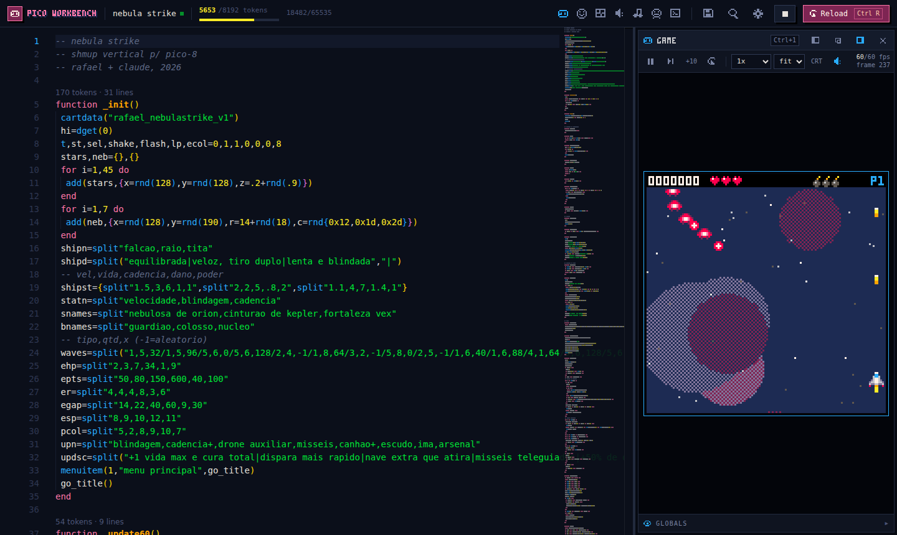
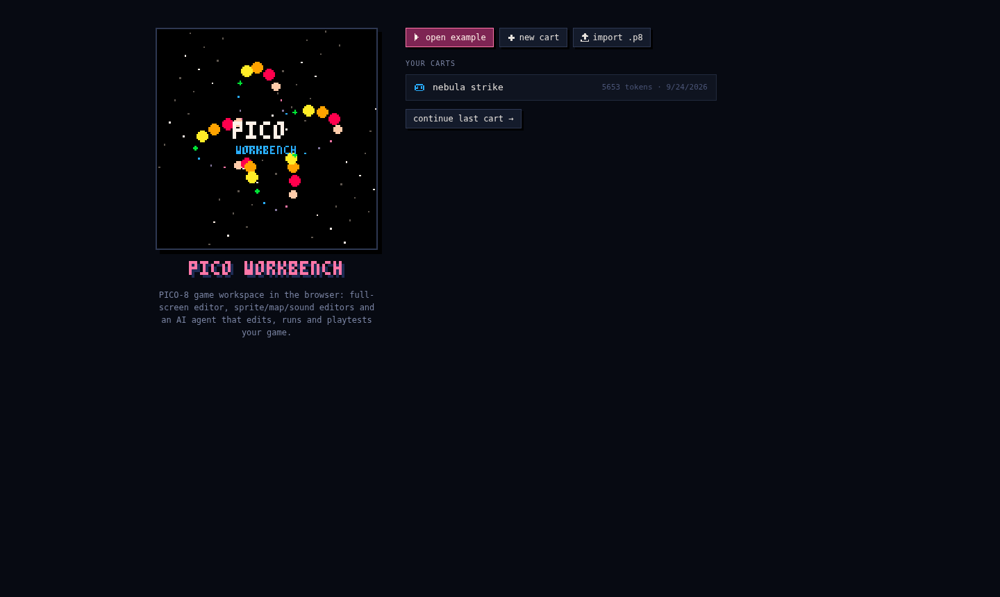
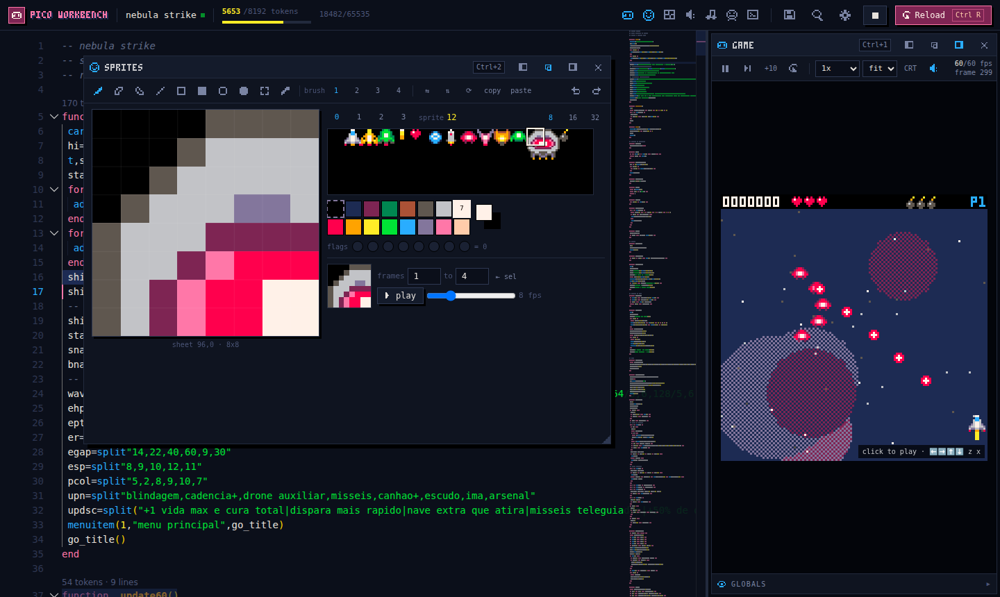
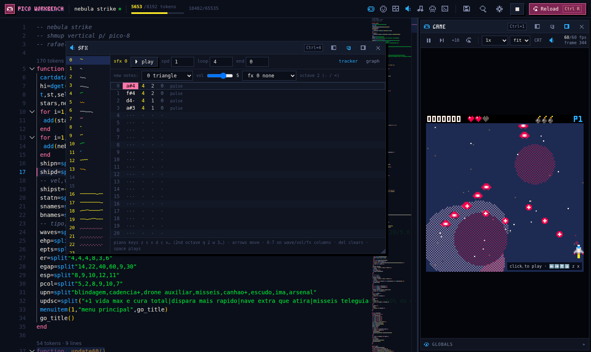

<div align="center">

# ▶ PICO WORKBENCH

**A PICO-8 game studio in your browser, with an AI agent that codes, draws, composes and playtests.**




</div>

PICO-8 has a charming editor, but it is tiny: 128x128 pixels. **PICO Workbench** keeps PICO-8's rules and look for the game and gives you a modern workspace around it:

- a full-screen code editor that understands PICO-8 Lua;
- sprite, map, sfx and music editors that update the running game live;
- an **AI agent** that edits everything, runs the game headless, looks at screenshots and sends bots to playtest.

The runtime is **written from scratch** (no Lexaloffle code or assets) and the whole thing is a **static site**: no server and no account. Bring your own OpenRouter key.

## ✨ Highlights

| | |
|---|---|
| 🎮 **Own PICO-8 runtime** | PICO-8 Lua is preprocessed into Lua 5.4 running in WebAssembly, with a 64 KiB memory map, 16.16 number quirks, P8SCII text codes, `flip()` and a watchdog for infinite loops. |
| ⌨️ **Editor-first** | Monaco with a `pico8-lua` grammar, API autocomplete, color swatches on hover, lint, token count per function, and runtime errors highlighted on the right line. |
| 🔥 **Hot reload** | `Ctrl+S` swaps in the new code without restarting the game. A globals inspector can edit variables while paused. |
| 🖌️ **Asset editors** | Sprites (8/16/32 blocks, tools, flags, animation preview, paste a PNG and it snaps to the palette), map, and an sfx tracker/graph plus a music editor. |
| 🔊 **Real synth** | AudioWorklet with the 8 PICO-8 waveforms and 7 effects, with sample-accurate timing. |
| 🤖 **AI agent** | 21 tools: edit code, draw sprites from hex grids, write sfx with note names, run headless with input scripts, take screenshot contact sheets, and **playtest bots** that report time to game over, errors and object peaks. Includes an approve mode with diffs and one-click "undo the whole task". |
| 🧪 **Tested** | `.p8` round-trips byte-for-byte, the token count matches shrinko8, the sample game runs 10,000 frames with random input, 342 unit tests and Playwright e2e. |

<table>
<tr>
<td></td>
<td></td>
<td></td>
</tr>
</table>

## 🤖 What the agent can do

> *"Add a fourth power-up to Nebula Strike that makes the shots home in for 10 seconds, draw its icon, create a pickup sfx and run a playtest to make sure nothing broke."*

The agent reads the cart, edits the code in small exact replacements, draws the 8x8 icon, writes the sfx, runs the game headless to catch errors, checks screenshots, and sends a `hold_fire_track` bot through the level. Every change becomes a snapshot you can undo.

## 🚀 Quick start

Requires Node LTS (20+). Works on Windows, macOS and Linux.

```sh
npm install
npm run dev         # http://localhost:5173
npm test            # unit tests (Vitest, 340+)
npm run test:e2e    # Playwright (builds and serves on :4173)
npm run build       # static site in dist/
```

Using the AI agent: open Settings (gear icon), paste an OpenRouter key. The default model is `google/gemini-3.1-flash-lite` (very cheap, tools + vision) with a $0.25 budget per task; history is compacted and code is read in pages to keep costs low. The key is stored only in `localStorage` and is sent only to openrouter.ai.

Shortcuts: `Ctrl+R` run/reload · `Ctrl+Enter` restart · `Ctrl+S` save + hot reload · `F5` play/pause · `F6` step · `Ctrl+K` command palette · `Ctrl+1..6` panels (game, sprites, map, sfx, music, agent) · `Esc` closes a panel.

## Deploy

- **GitHub Pages:** `.github/workflows/deploy.yml` builds on every push to `main` with `BASE_PATH=/<repo>/`. Enable Pages with "GitHub Actions" as the source.
- **Vercel:** import the repo (`vercel.json` is included), no configuration needed.

## How the runtime works

1. **Preprocessor** (`src/runtime/preprocess`): a PICO-8 lexer (shared with the token counter) feeds a recursive-descent parser. The code generator emits Lua 5.4 on the same source lines, so error lines map 1:1.
   - It expands compound assignment and turns short `if`/`while` and `?` into normal statements.
   - PICO-8-only operators (`\`, `& | ^^ ~ << >> >>> <<> >><`, `@ % $`) become helper calls.
   - Numbers are emitted with their exact 16.16 value.
2. **Numbers:** Lua floats, with 16.16 emulated where games depend on it: bitwise ops and shifts, `tostr` flags, `tonum`, `peek4`, `dget`, and literal wrap-around (`0xffff == -1`). `..` formats numbers the way PICO-8 does.
3. **Machine** (`src/runtime/machine.ts`):
   - Memory is a real 64 KiB `Uint8Array` laid out like PICO-8 (screen at 0x6000, draw state at 0x5f00…), so `poke` tricks work.
   - Graphics, memory and input are TypeScript registered as raw Lua C functions (about 12x faster than wasmoon's generic bridge). Math, tables and strings stay in Lua.
   - The cart runs in its own environment. Top-level code and `_init` run in a coroutine (so `flip()` works), then `_update60`/`_update` and `_draw`.
   - A `debug.sethook` watchdog stops frames that run longer than 2 s.
4. **Audio:** the same sequencer runs on the main thread (for `stat()`) and inside the AudioWorklet (for sound).
5. **Headless:** the same `Machine`, with no clock, driven frame by frame with input scripts. It powers tests, the agent's tools (inside a Web Worker) and the playtest bots.

## Status and known gaps

- Custom sfx instruments and sfx filters (noiz, buzz, reverb…) are approximated or ignored.
- `.p8.png` carts and `#include` are not supported (only `.p8` text).
- The "strict 16.16 overflow" toggle is planned; see `docs/PLAN.md`.
- `TODO(milestone-8)`: code-splitting of the bundle (Monaco is about 4 MB).
